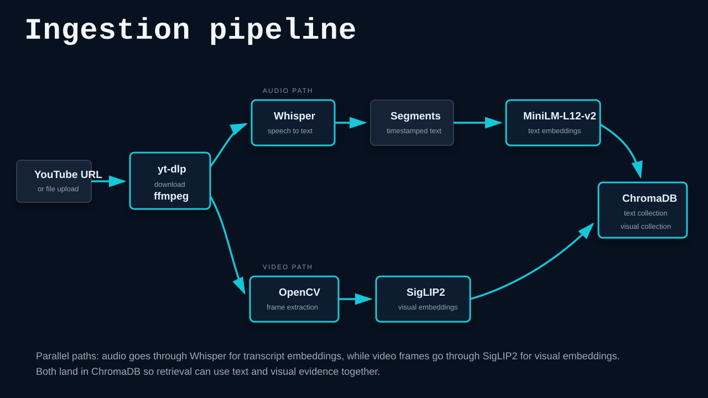
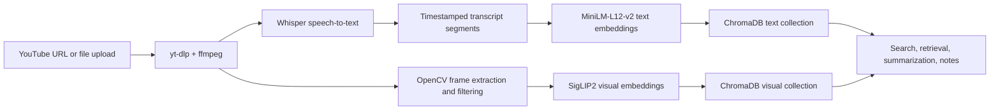

# AI Video Memory Vault - Project Notes

## 1. Product Idea

This project is an AI-powered personal memory vault for videos, reels, shorts, and other saved media links.

The core user problem is simple: people often find useful videos while scrolling, but they are not in the right mood or context to watch, understand, research, and organize them immediately. Those videos get saved inside Instagram, YouTube, TikTok, or random chats, but they rarely become useful later.

The goal is to let a user share or paste a video link and have the system turn it into a structured memory object:

- summary
- category
- tags
- key moments
- visible text
- transcript
- resources for deeper learning
- follow-up questions
- searchable saved note

Long term, the product should support an Instagram account or bot where a user can share a Reel in chat and receive the summary, resources, and categorization directly in the DM.

## 2. Refined Product Definition

The best framing is not simply "AI video summarizer."

The stronger product framing is:

> A personal delayed-intent memory vault that turns saved videos into useful future knowledge.

The user is not just saving a link. They are asking:

> "I found this interesting, but future me needs the researched, organized, understandable version."

The platform should feel like a second brain for videos.

## 3. Main Use Cases

- Study reels and lectures
- Cooking videos and recipe techniques
- Coding tutorials
- Finance or business explainers
- Fitness or movement demos
- Product/tool recommendations
- Book/course/resource recommendations
- Visual guides, charts, diagrams, and screenshots
- Videos that need additional research before they become useful

## 4. Why Transcript Alone Is Not Enough

Metadata and transcript can be useful, but many videos contain important information directly in the visuals.

Examples:

- recipe steps shown silently
- ingredient lists shown on screen
- math equations written on a board
- diagrams, charts, and graphs
- product names shown visually
- screenshots of apps or code
- before/after transformations
- gestures or physical demonstrations
- captions burned into the video but not available as transcript

Therefore, the platform eventually needs multimodal video understanding, not just transcript summarization.

## 5. How Video Understanding Works

AI systems usually do not "watch" an entire video in the human sense. They break it into parts and process those parts.

Basic flow:

```text
Video link
-> fetch/download media where allowed
-> extract metadata
-> extract transcript/captions if available
-> extract or transcribe audio
-> sample frames
-> remove duplicate or low-value frames
-> run OCR on selected frames
-> run visual analysis on selected key frames
-> merge transcript + OCR + visual descriptions
-> generate structured summary and memory object
```

For a 30-second reel, the system may sample frames densely.

For a 45-minute lecture, the system must be much more selective.

## 6. How Important Moments Are Detected

Important moments can be detected through a combination of cheap computer vision, OCR, audio/transcript analysis, and selective AI reasoning.

Signals that a segment may be important:

- major visual scene change
- new slide appears
- new text appears on screen
- graph, chart, diagram, table, or code appears
- transcript contains phrases like "the key point is", "notice this", "the trick is", or "as you can see"
- final result appears
- object state changes, such as ingredients becoming a finished dish
- user intent category suggests visuals matter, such as cooking, fitness, math, design, or coding

Example timeline:

```text
00:00-00:04 - Hook
00:05-00:09 - Setup or ingredients
00:10-00:16 - Main process
00:17-00:22 - Important technique
00:23-00:30 - Final result
```

The output should explain not only what happened, but why a moment was selected.

## 7. Cost And Token Usage Concerns

A naive system would be too expensive.

Bad approach:

```text
45-minute video
-> extract 1 frame every second
-> send 2700 frames to a vision model
-> huge cost and unnecessary processing
```

Better approach:

```text
45-minute video
-> transcript first
-> scene change detection
-> duplicate frame removal
-> OCR on representative frames
-> send only important frames to a vision model
-> store processed chunks and embeddings
```

The system should not blindly send every frame to an LLM or multimodal model.

## 8. How Startups Usually Reduce Cost

Most AI video tools likely use a layered pipeline:

1. Use transcript/captions first where available.
2. If transcript is missing, transcribe audio with Whisper, Deepgram, AssemblyAI, or similar.
3. Split transcript into timestamped chunks.
4. Summarize chunks in layers.
5. Detect slide changes or visual changes using cheap computer vision.
6. Remove duplicate or near-identical frames.
7. Run OCR on selected frames.
8. Send only difficult or important frames to a multimodal model.
9. Store summaries, OCR text, timestamps, and embeddings.
10. Use retrieval-augmented generation for later search and chat.

This is how a service can process a 30-45 minute lecture without visually analyzing every frame using an expensive model.

## 9. Cheap Pre-AI Frame Filtering

Many decisions can be made before using an expensive AI model.

### Duplicate Frame Detection

Use:

- perceptual hash
- SSIM similarity
- histogram comparison
- frame difference thresholding
- image embeddings

This helps detect when the same slide or scene remains on screen for a long time.

### Blank Or Transition Frame Detection

Use cheap pixel statistics:

- low brightness variance
- mostly black or white frame
- little edge/detail information
- short duration
- low OCR/text signal

### Facecam Detection

Use:

- OpenCV face detection
- MediaPipe
- YOLO or other object detectors
- layout classification

If a frame is mostly a speaker's face with no visible text or diagram, transcript/audio is usually more valuable than visual analysis.

### Slide, Screen, Chart, Or Diagram Detection

Frames with text blocks, tables, charts, straight lines, screen content, or diagrams receive higher visual value scores.

Only high-value frames are sent to expensive vision models.

## 10. Different Strategy By Video Type

The pipeline should adapt based on the kind of video.

### Short Reel Or Short

- dense frame sampling
- OCR-heavy
- vision-heavy if silent or visual-first
- category detection
- key moment extraction

### Long Lecture

- transcript-first
- slide-change detection
- OCR representative slides
- vision only for graphs, diagrams, equations, tables, or low-OCR frames
- chunked summaries and vector search

### Podcast Or Facecam

- audio-first
- transcript summarization
- minimal vision

### Cooking Video

- visual + transcript + OCR
- step extraction
- ingredients and quantities
- timing and technique detection

### Coding Tutorial

- transcript + OCR
- code frame extraction
- links/tools/packages mentioned
- structured steps

## 11. MVP Scope

The MVP should start with YouTube only.

Starting with every platform, especially Instagram and TikTok, will make the project too complicated early because platform APIs and media access are restricted.

MVP features:

- user authentication
- paste YouTube link
- fetch metadata
- fetch transcript when available
- audio transcription fallback if needed
- basic frame extraction
- duplicate frame removal
- OCR on selected frames
- AI summary generation
- category and tags
- key timestamps
- resource suggestions
- saved dashboard
- search and filters
- video detail page

## 12. Future Scope

Later phases can include:

- Instagram Reels support
- TikTok support
- Instagram DM bot
- browser extension
- mobile share sheet
- weekly digest
- flashcards
- study-note generation
- recipe extraction
- multilingual support, especially Hindi and Hinglish
- personal knowledge graph
- chat with saved video library

## 13. Instagram DM Bot Concept

Future flow:

```text
User shares Reel to platform Instagram account
-> Instagram webhook receives message
-> backend extracts reel reference or URL
-> processing pipeline runs
-> summary/resources are saved to user account
-> bot replies in DM with structured result
```

This may require:

- Meta Developer app
- Instagram Business account
- Instagram Messaging API
- webhooks
- app review
- platform compliance
- fallback handling if media cannot be directly accessed

## 14. Similar Services To Study

Services worth manually testing:

- Churo - https://www.churo.in/
- InstaBrain - https://instabrain.app/
- Onmind - https://onmind.app/
- LilyBoard - https://lilyboard.com/
- ReelText - https://reel-transcriber.vercel.app/
- Memories.ai Instagram Reels Summarizer - https://memories.ai/ai-video-summarizer/instagram-reels-summarizer
- ScreenApp AI Video Summarizer - https://screenapp.io/features/ai-summarizer
- SocialKit Instagram Video Summarizer - https://www.socialkit.dev/instagram-video-summarizer
- Hey Isabella AI Reel Summarizer - https://www.heyisabella.ai/product/summarize-ig-reel/
- Spot This - https://www.spotthis.fit/

Closest matches to the Instagram DM idea:

- Onmind
- LilyBoard
- Spot This, though its use case is more AI/deepfake/fact-check analysis

## 15. Edge Cases To Test On Existing Services

Use these to understand whether a tool relies on transcript, metadata, OCR, or visual reasoning.

1. Muted video with only visuals
2. Facecam-only video with no captions
3. One static image for 30 seconds
4. Fast flashing text
5. Graph or chart while the speaker says "as you can see"
6. Cooking video with no speech
7. Wrong title/caption compared to actual video
8. Hindi/Hinglish audio with English on-screen text
9. Video with important info visible for only 1-2 seconds
10. Lecture with slides and no visible speaker

Expected discovery:

- transcript-heavy tools will perform well on lectures and spoken videos
- OCR-heavy tools will perform better on slides and static text
- true visual-understanding tools will perform better on silent cooking, fitness, diagrams, and demos
- weak tools may over-trust metadata or captions

## 16. Job Requirement Summary

The person building this should be able to create a full-stack MVP with an AI/video-processing backend.

Ideal skills:

- full-stack development
- Next.js or React
- Python/FastAPI or Node.js/NestJS
- PostgreSQL
- background queues
- FFmpeg
- OpenCV
- OCR
- speech-to-text
- LLM and multimodal API integration
- vector search
- cost optimization
- YouTube processing
- future Meta/Instagram API integration

## 17. Suggested Tech Stack

Frontend:

- Next.js
- React
- TypeScript
- Tailwind CSS

Backend:

- Python/FastAPI or Node.js/NestJS
- PostgreSQL
- Redis queue with Celery, RQ, or BullMQ
- object storage for frames/thumbnails if needed

AI/video:

- yt-dlp for video/audio acquisition where legally and technically allowed
- FFmpeg for audio and frame extraction
- Whisper or hosted transcription service
- OpenCV for scene detection and deduplication
- Tesseract, PaddleOCR, EasyOCR, or cloud OCR
- OpenAI, Gemini, Claude, or similar for summarization and vision
- pgvector, ChromaDB, Pinecone, or similar for embeddings/search

## 18. Expected Structured Output

Each processed video should become a structured object:

```json
{
  "title": "Video title",
  "platform": "youtube",
  "category": "Cooking",
  "tags": ["garlic noodles", "quick recipe", "sauce technique"],
  "summary": "Short useful summary.",
  "key_points": [
    "Main point 1",
    "Main point 2"
  ],
  "important_moments": [
    {
      "timestamp": "00:14-00:19",
      "description": "Key technique is demonstrated here.",
      "reason": "This is where the main useful action happens."
    }
  ],
  "visible_text": [
    "cook for 2 minutes",
    "add soy sauce"
  ],
  "resources": [
    {
      "title": "Related article or resource",
      "url": "https://example.com",
      "reason": "Useful follow-up."
    }
  ],
  "review_questions": [
    "What can replace soy sauce?",
    "Can this method work with rice?"
  ]
}
```

## 19. Base Architecture

The starting architecture from the reference image uses separate audio and video paths, then stores both text and visual embeddings.



Same architecture as Mermaid:



## 20. Proposed MVP Processing Pipeline

```text
1. User submits YouTube URL.
2. Backend creates a video processing job.
3. Worker fetches metadata and transcript if available.
4. If transcript is missing, worker extracts audio and transcribes it.
5. Worker samples frames from the video.
6. OpenCV removes duplicate, blank, and low-value frames.
7. OCR extracts visible text from selected frames.
8. Vision model analyzes only high-value frames if needed.
9. Transcript, OCR, and visual descriptions are merged into timestamped chunks.
10. Embeddings are generated for retrieval.
11. LLM produces summary, categories, tags, key moments, resources, and review questions.
12. Final memory object appears in the user dashboard.
```

## 21. Main Principle

The system should optimize for usefulness, not raw completeness.

The key engineering question is:

> Which parts of the video deserve expensive understanding?

The system should spend more compute on information-rich moments and less compute on duplicates, blank transitions, facecam-only sections, and already-covered speech.

