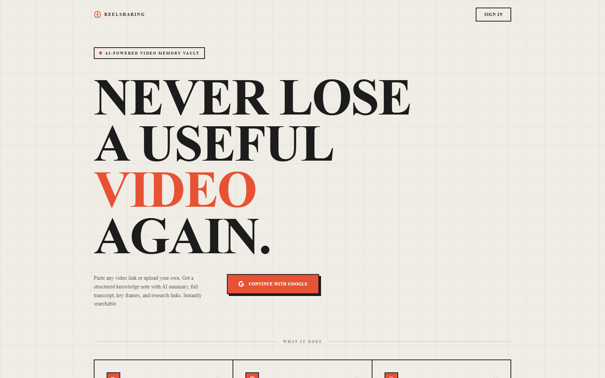
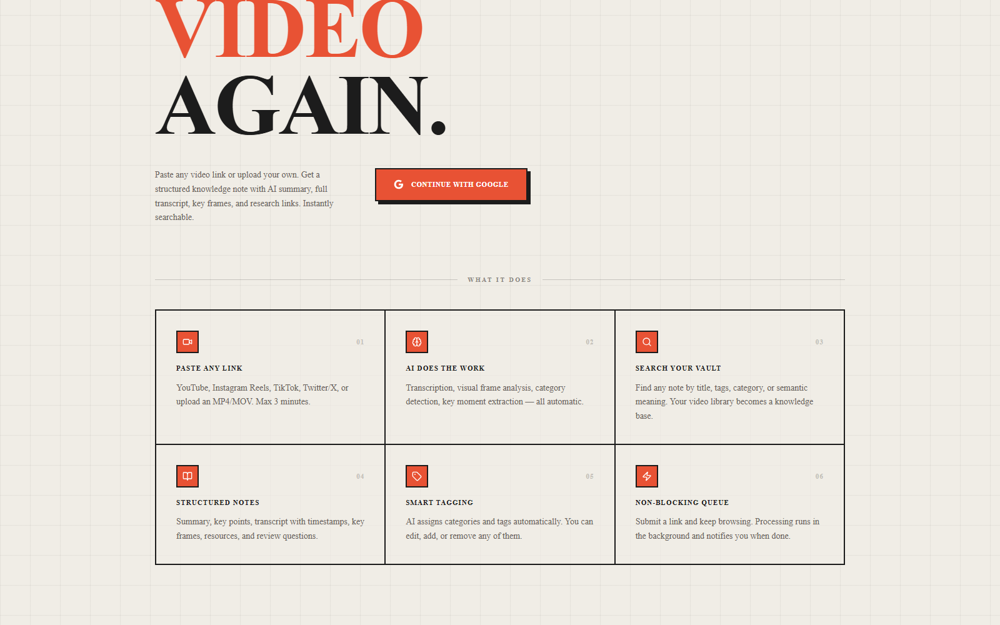
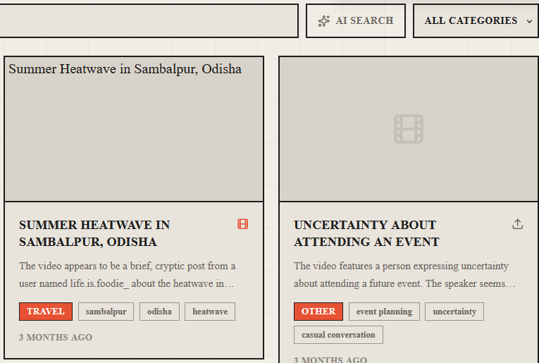

# ReelSharing

An AI-powered memory vault for saved videos. Paste a link — Instagram Reel, TikTok, YouTube, Twitter/X — or upload a clip, and it comes back as a structured, searchable note: AI summary, full transcript, key frames, category, tags, and follow-up research links. Built for the video you saved because it looked useful, but had no time to actually process.

**Live:** [reel-sharing.vercel.app](https://reel-sharing.vercel.app)

## What it does

- **Paste any link** — Instagram Reels, TikTok, YouTube, Twitter/X, or upload an MP4/MOV directly (max 3 minutes)
- **AI does the work** — transcription, visual frame analysis, category detection, and key-moment extraction, fully automatic
- **Structured notes** — summary, key points, timestamped transcript, extracted key frames, and suggested resources/review questions per video
- **Smart tagging** — categories and tags assigned by AI, editable afterward
- **Search your vault** — find any note by title, tags, category, or semantic (AI) search
- **Non-blocking queue** — submit a link and keep browsing; processing runs in the background and notifies you when done

Transcript alone misses information that only appears on screen (recipe steps, on-screen text, diagrams), so processing includes visual frame analysis, not just audio.

## Screenshots





Notes in the vault, showing AI-assigned category, tags, and summary:



## Stack

| Layer | Technology |
|---|---|
| Frontend | Next.js 16, React 19, Tailwind CSS |
| Backend | FastAPI (Python) |
| AI | Groq (transcription/summarization), Tavily (research links) |
| Video ingestion | yt-dlp, youtube-transcript-api, OpenCV, ffmpeg |
| Auth / DB / Storage | Supabase |
| Deployment | Vercel (frontend) |

## Project structure

```
frontend/    Next.js app — auth, vault UI, search
backend/     FastAPI service — link ingestion, transcription, AI summarization/tagging, key-frame extraction
supabase/    Schema and migrations
docs/        Design and planning notes
```

See [`PROJECT_OVERVIEW.md`](./PROJECT_OVERVIEW.md) for the full product rationale.
